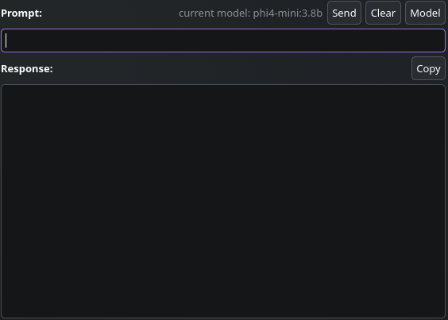

# Pipsqueak — KDE Plasma 6 widget for Ollama and OpenAI-compatible LLMs



**Pipsqueak** is a lightweight **KDE Plasma 6 widget** for chatting directly with a local or self-hosted LLM through an **OpenAI-compatible API**. It is designed first for **Ollama** on Linux, with `http://localhost:11434` as the default server.

Use it from the Plasma panel or desktop to select an available model, send a prompt, and copy the response—without opening a browser or separate chat client.

## Features

- Native **KDE Plasma 6 / Plasma Shell** widget (plasmoid)
- Works with **Ollama** and servers exposing OpenAI-compatible endpoints
- Loads available models from `GET /v1/models`
- Sends chat requests to `POST /v1/chat/completions`
- Configurable server URL and system prompt
- Compact panel icon plus an expandable chat interface
- Copy responses to the clipboard
- Local-first by default: connects to `http://localhost:11434`

## Requirements

- KDE Plasma 6
- `kpackagetool6`
- An accessible OpenAI-compatible LLM server, such as [Ollama](https://ollama.com/)

> [!NOTE]
> Pipsqueak currently sends unauthenticated requests. Use it with a local server or a trusted endpoint that does not require an API key.

## Install

### From source

```bash
git clone https://github.com/cat-thats-fat/pipsqueak.git
cd pipsqueak
kpackagetool6 --type Plasma/Applet --install .
```

To update an existing installation after pulling changes:

```bash
kpackagetool6 --type Plasma/Applet --upgrade .
```

Then open Plasma's **Add Widgets** picker and add **Pipsqueak** to your panel or desktop.

### Remove

```bash
kpackagetool6 --type Plasma/Applet --remove pipsqueak
```

## Quick start with Ollama

1. Install Ollama and make sure its server is running.
2. Pull a chat model, for example:

   ```bash
   ollama pull llama3.2
   ```

3. Add Pipsqueak from Plasma's widget picker.
4. Open the widget, select **Model**, choose the model, enter a prompt, and select **Send**.

The default endpoint is already correct for a local Ollama server:

```text
http://localhost:11434
```

## Configure an OpenAI-compatible server

Right-click Pipsqueak → **Configure Pipsqueak** → **General**.

Set **OpenAI Compatible Endpoint** to the server's base URL—for example:

```text
http://localhost:11434
```

Do **not** add `/v1`: Pipsqueak appends `/v1/models` and `/v1/chat/completions` itself.

You can also set a **System Prompt** to guide every request.

## Compatibility

Pipsqueak expects an OpenAI-compatible service that supports:

- `GET /v1/models` returning a `data` list of models
- `POST /v1/chat/completions` returning a non-streaming chat-completions response

This includes Ollama's OpenAI compatibility API and may include compatible local/self-hosted servers configured without authentication.

## Troubleshooting

### No models appear

- Confirm the server is reachable at the configured base URL.
- For Ollama, check that it is running and that a model is installed:

  ```bash
  ollama list
  ```

- Verify the endpoint manually:

  ```bash
  curl http://localhost:11434/v1/models
  ```

### The widget cannot connect to a remote server

Confirm the remote server is listening on a reachable address and permits connections from your Plasma desktop. Prefer a private network, Tailscale, or another trusted transport for remote LLM servers.

## Contributing

Issues and pull requests are welcome. For feature ideas and bugs, include your Plasma version, server software, endpoint shape, and steps to reproduce.

## License

[GPL-3.0](LICENSE)

## Keywords

KDE Plasma 6 widget, Plasma plasmoid, Ollama widget, local LLM, OpenAI-compatible API, Linux AI assistant, self-hosted LLM chat, desktop LLM client.
